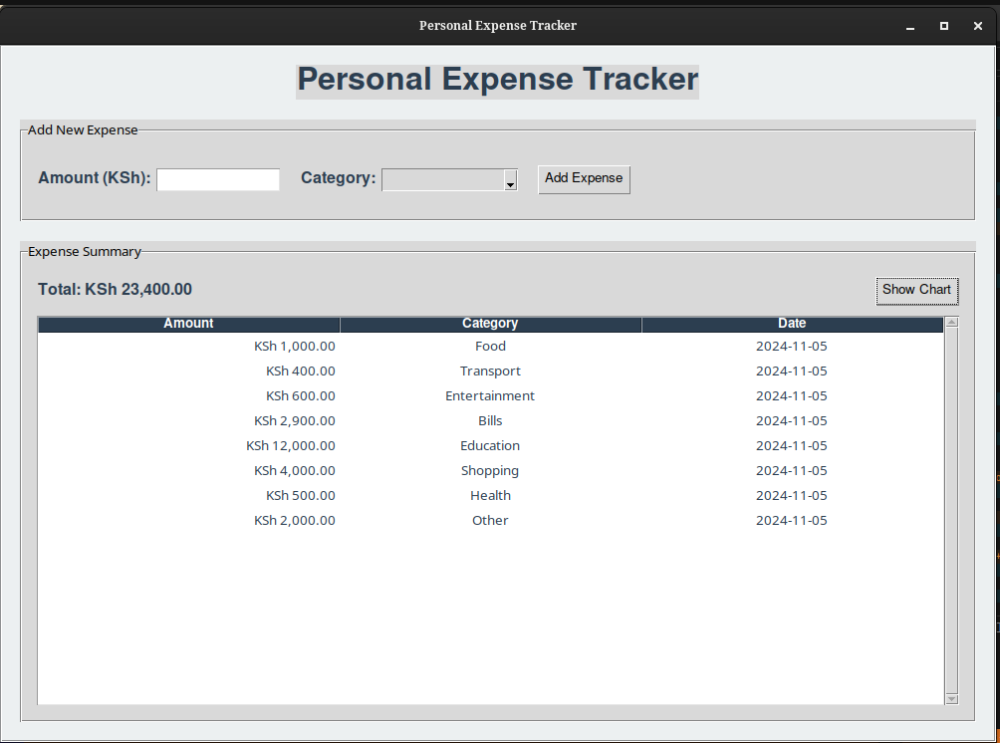
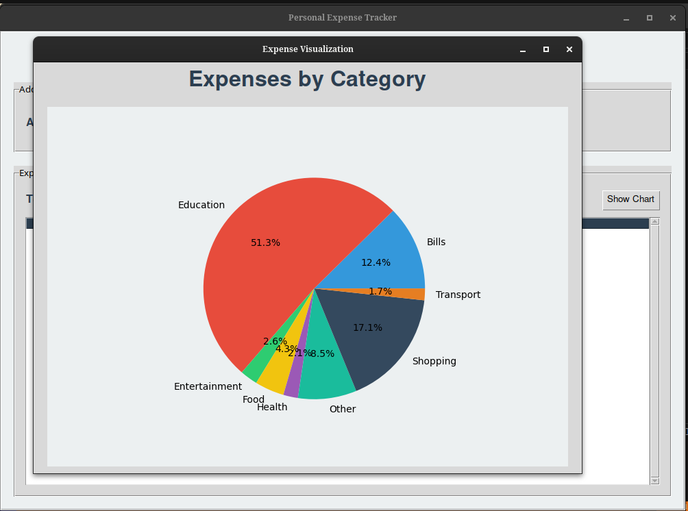

# Personal Expense Tracker

A desktop application built with Python and Tkinter that helps users track and visualize their personal expenses.

## Features

- 💰 Easy expense entry with amount and category
- 📊 Visual representation of expenses through pie charts
- 📝 Detailed expense history with scrollable view
- 💵 Support for KSh (Kenyan Shilling) currency
- 🗃️ SQLite database for persistent storage
- 📱 Modern and user-friendly interface

## Prerequisites

Before running the application, ensure you have the following installed:
- Python 3.x
- tkinter
- matplotlib
- sqlite3 (usually comes with Python)


## Installation

1. Clone this repository or download the source code:
```
git clone [repository-url]
```
2. Navigate to the project directory:
```
cd personal-expense-tracker
```
3. Run the application:
```
python main.py
```


## Usage

1. **Adding an Expense**
   - Enter the amount in KSh
   - Select a category from the dropdown menu
   - Click "Add Expense"

2. **Viewing Expenses**
   - All expenses are displayed in the main window
   - Total expenses are shown at the top
   - Expenses are sorted by date (newest first)

3. **Visualizing Data**
   - Click "Show Chart" to open a pie chart visualization
   - The chart shows the distribution of expenses across categories

## Categories

The application supports the following expense categories:
- Food
- Transport
- Entertainment
- Bills
- Shopping
- Health
- Education
- Other

## Technical Details

- Built with Python and Tkinter for the GUI
- Uses SQLite for database management
- Implements Matplotlib for data visualization
- Features a responsive and modern design with custom styling

## File Structure

- `main.py`: The main application script
- `expense_tracker.db`: The SQLite database file
- `README.md`: This file


## Contributing

Feel free to fork this repository and submit pull requests. For major changes, please open an issue first to discuss what you would like to change.

## License

This project is licensed under standard copyright laws. All rights reserved.

## Author

Kevin (© 2024)

## Screenshots


# expense-tracker
